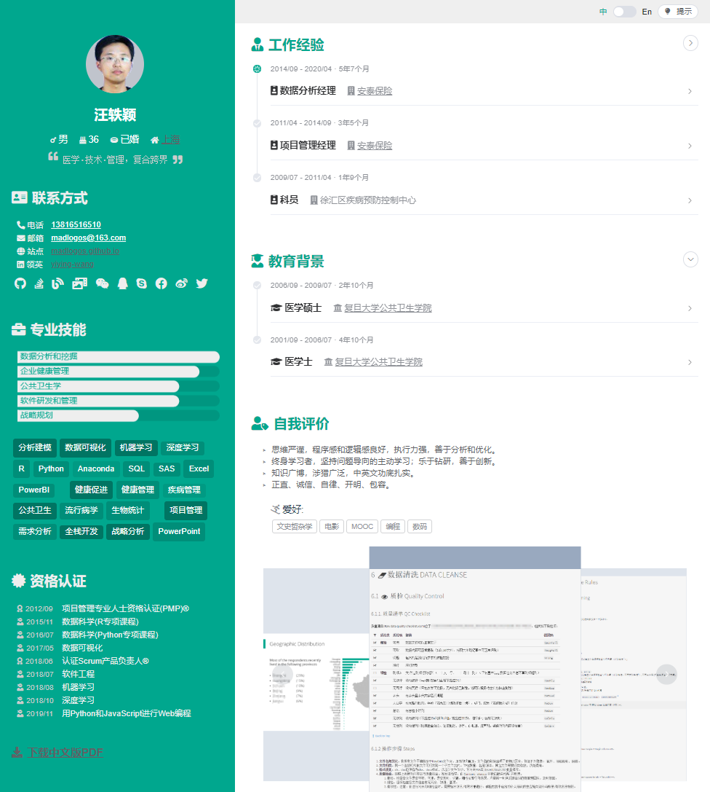
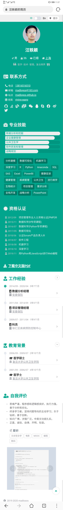

# vue-resume: 基于VueJS+ElementUI的双语在线简历实现

[](https://www.travis-ci.org/madlogos/vueresume)

本应用基于[`@vue/cli@4`](https://cli.vuejs.org/zh/)构建。此外，还用到了：

- [`ElementUI`](https://element.eleme.cn/#/zh-CN)提供的Vue组件功能；
- [`ECharts`](https://www.echartsjs.com/zh/index.html)提供的JS交互图功能；
- [`vue-i18n`](https://kazupon.github.io/vue-i18n/)提供的多语言功能；
- [`axios`](https://github.com/axios/axios)提供的API交互功能；
- [`vuex`](https://vuex.vuejs.org/zh)提供的Vue组件间数据共享功能。

本应用支持两种用法：无编译直接使用、自定义配置编译。

1. [无编译](#无编译用法)：切换到`gh-pages` git分支，在dist目录下编辑logo.png、img目录中的图片和cv.json中的数据，即可快速实现一份你自己的自适应双语在线简历；
1. [需编译](#需编译用法)：
    1. 在`master`分支中进行自定义修改（参考@vue/cli@4指南，下文详述），或
    1. 切换`vue-cli2`分支中进行自定义修改（参考vue-cli@2指南，下文从略）

    然后`npm run build`编译，再将dist目录发布到`gh-pages`分支。

最终简历会显示在`https://<你的github用户名>.github.io/vueresume`，效果如下。

- PC 显示效果



- 手机显示效果



## 无编译用法

1. fork本repo后，git切换到`gh-pages`分支；
1. 根据需要，编辑cv.json、logo.png（头像）和img目录下的图片，保存后即可生效。

cv.json是本应用所调用的数据，通过`axios`进行API读取，加载到Vue。其基本结构是`{'zh': 简体中文数据, 'en': 英文数据}`，不同语言分支的数据结构是相同的（如[下节](#数据结构)所示）。

> - 部分数据"经过加密"，是指经`encodeURIComponent()`处理后`btoa()`加密；
> - 'fa'则表示[fontawesome](https://fontawesome.com/)图标。

### 数据结构

```plain
-- basic: (dict) 基本信息
  |-- name: 姓名，数据经加密
  |-- gender: (dict) 性别
  |  |-- fa: fontawesome图标
  |  `-- value: 显示文字
  |-- dob: (dict) 出生日期
  |  |-- fa: fontawesome图标
  |  `-- value: 日期(yyyy/m/d格式)，数据经加密
  |-- marriage: (dict) 婚姻
  |  |-- fa: fontawesome图标
  |  `-- value: 显示文字
  |-- home: (dict) 现居住地
  |  |-- fa: fontawesome图标
  |  |-- value: 显示文字
  |  `-- link: 链接，指向地图
  `-- motto: 格言
-- contact: [list] 联系方式
  |-- (dict) 具体联系方式，
  |  |-- name: 联系方式名称
  |  |-- fa: 图标
  |  |-- value: 取值，经过加密
  |  `-- link: 链接，经加密
  `-- ... (dict) 结构同上，可不断扩展
-- socio: [list] 社交网络
  |-- (dict) 具体社交网络信息
  |  |-- name: 社交网络名称
  |  |-- fa: 图标
  |  |-- value: 取值，显示在浮窗
  |  `-- link: 链接，显示在浮窗
  `-- ... (dict) 结构同上，可不断扩展
-- talent: [list] 才能，显示在「专业技能」的条图中
  |-- (dict) 具体才能
  |  |-- name: 才能名称
  |  |-- value(0-100): 才能取值，决定条图中横条的长度
  |  `-- tip: 浮窗提示文字
  `-- ... (dict) 结构同上，可不断扩展
-- skill: [list] 技能
  |-- (list) 技能组，在「专业技能」的交互el-tag中以段落形式分开
  |  |-- (dict) 具体技能
  |  |  |-- name: 技能名称，显示为el-tag
  |  |  |-- from, thru: 起止时间，一般写为年份或"now"。应用会调用函数计算年数
  |  |  |-- prof(0-5): 娴熟程度，显示为星的个数
  |  |  |-- p: (list) 浮窗中的介绍文字，list有几个元素，就显示为几段
  |  |  |-- ul: (list) 浮窗中的bullet point文字，list中有几个元素，就显示几个小点。支持html
  |  |  |-- size: 控制el-tag的大小，可选值有null, "medium"和"small"
  |  |  `-- alpha(0-1): 控制el-tag的透明度
  |  `-- ... (dict) 结构同上，可不断扩展
  `-- ... (list) 结构同上，可不断扩展
-- cert: (list) 证书
  |-- (dict) 具体证书
  |  |-- caption: 证书显示名，显示在页面上
  |  |-- fa: 图标
  |  |-- time: 获得证书时间（yyyy/m/d格式）
  |  |-- name: 证书标准名，显示在浮窗
  |  |-- provider: 授课机构，null或dict
  |  |  |-- name: 授课机构名称
  |  |  `-- link: 授课机构链接
  |  |-- institute: 证书颁发机构，null或dict
  |  |  |-- name: 颁发机构名称
  |  |  `-- link: 颁发机构链接
  |  |-- sn: 证书号
  |  |-- p: (list) 浮窗中的介绍文字，支持html
  |  `-- ol: (list) 浮窗中的bullet point文字
  `-- ... (dict) 结构同上，可不断扩展
-- job: (list) 工作经历
  |-- from, till: 工作起讫时间（yyyy/m/d格式）
  |-- emp: 雇主名称
  |-- link: 雇主链接
  |-- wiki: (dict) 雇主介绍，显示在浮窗
  |  |-- fa: 图标
  |  |-- title: 浮窗标题
  |  |-- value: 浮窗文字
  |  |-- tag: (list) 浮窗中的el-tag
  |  `-- link: 雇主介绍的链接
  |-- title: 工作头衔
  |-- icon: el-timeline显示的图标样式，已结束的工作为"check"，当前的工作为"loading"
  |-- active: 是否当前仍在职，true或false
  |-- keyword: (list) 工作关键词，显示为el-tag
  |-- description: (list) 工作描述，list中每个dict元素显示为一段
  |  |-- p: (list) 某一条描述，list中每个元素显示为一句。支持html
  |  `-- ul: (list) 具体描述，list中每个元素显示为一个bullet point。支持html
  `-- project: (list) 项目
     |-- title: 项目名称
     |-- from, thru: 项目起讫时间（yyyy/m/d格式）
     `-- work: (list) 具体工作内容，list中每个元素显示为一段
-- edu: (list) 教育经历
  |-- from, till: 教育起讫时间（yyyy/m/d格式）
  |-- school: 学校名称
  |-- link: 学校链接
  |-- wiki: (dict) 学校介绍，显示在浮窗
  |  |-- fa: 图标
  |  |-- title: 浮窗标题
  |  |-- value: 浮窗文字
  |  |-- tag: (list) 浮窗中的el-tag
  |  `-- link: 学校介绍的链接
  |-- major: 专业
  |-- cred: 学位
  |-- icon: el-timeline显示的图标样式，已结束的教育经历为"check"，当前的教育经历为"loading"
  |-- active: 是否当前仍在读，true或false
  |-- rank: 排名
  `-- lessons: (list) 课程，list中每个元素显示为一段。支持html
-- self: (dict) 关于自己
  |-- statement: (list) 自我评价，list中每个元素显示为一句
  |-- interest: (list) 兴趣爱好，list中每个元素显示为一个el-tag
  `-- gallery: (list) 轮播图片，即dist/img中的图片名称
-- misc: (dict) 其他
  |-- tip: (dict) 页面右上角tip按钮显示的浮窗内容
  |  |-- title: 浮窗标题
  |  `-- msg: 浮窗正文，支持html
  |-- footnote: 页脚，支持html
  |-- copyright: 版权声明，支持html
  `-- attachment: 附件地址（本应用对应的pdf所在地址）
```

上述数据和页面组件的对应关系如图：


## 需编译用法

如要进行深度修改，需要通过`npm`或`yarn`安装编译。

### 准备工作

1. 安装[`npm`](https://www.npmjs.com/get-npm);
1. 将本仓库clone到本地，确保处于master分支;
1. 命令行进入根目录，`npm install`，以安装package.json定义的依赖包。这些包会被安装到node_modules目录;
1. `npm run serve`进行测试环境编译，浏览器打开<http://localhost:8080>查看效果，确定代码可正常运行。

### 初阶修改

在public/img中修改图片，或修改public/logo.png、public/cv.json。通过编译，这些文件会被复制到dist目录下。具体方法同[上一节](#无编译用法)。

### 进阶修改

#### 多语言

多语言环境配置在src/asets/i18n中。目前只支持简体中文和英文。通过修改zh.js或en.js，可改变页面组件中的固定标题、时间显示格式等。

```plain
-- name: 网页标题
-- title: 各组件标题，如英文版「专业技能」的标题叫"Expertise"，是通过title.talent定义的
-- timespan: 时间长度的格式，如`nyear: '0 year | 1 year | {n} years'`，就会自动匹配年份的单复数形式为year/years。
-- skill: 技能浮窗中的小标题
-- cert: 证书浮窗中的小标题
```

#### 颜色

src/styles目录下的_colors.scss保存了一些主要颜色定义，如：

- 主题色 $col-thm: #00A78E;
- 半透明主题色 $col-thm-opaque: #00A78E88;
- 更透明主题色 $col-thm-opaquer: #00A78E11;

你可以将这些值替换为自己喜欢的颜色，__但不要修改色彩值的名称__。

#### 更进一步

你可以学习更多VueJS的知识，自己进一步修改src中的其他组件。本应用中，入口文件src/App.vue绑定了src/router中定义的路由；src/router/index.js定义了主路由Resume/，绑定src/views/Resume.vue；而Resume.vue异步加载了src/components中定义的所有组件。你可以通过修改Resume.vue和src/components中的组件，改变最后的呈现效果。

### 发布

完成修改完毕后，运行`npm run serve`观察效果，运行`npm run test:unit`进行测试（前提是在tests目录中定义了测试用例），运行`npm run build`编译到生产环境。完成生产编译后，将dist目录中的内容提交到`gh-pages`分支即可。

你也可以参考deploy.sh，自己写一个自动提交脚本，或通过Travis CI持续集成服务进行自动编译。
